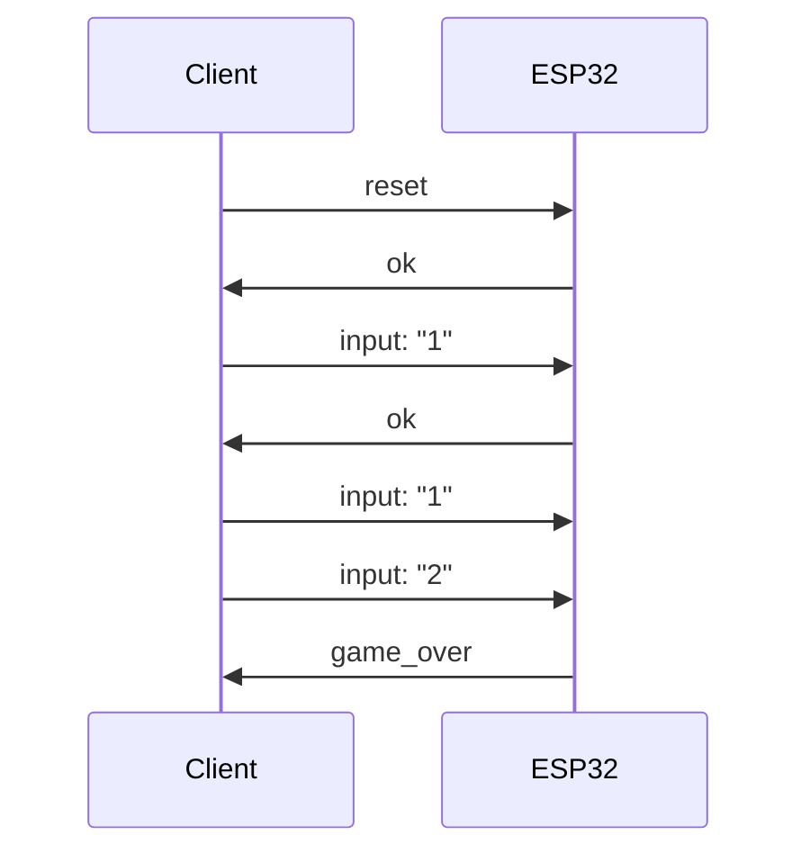

# IoT Frontend

## Installation

This app requires `node` and `npm` to be installed.

Install dependencies:

```console
npm install
```

Run the app in development mode:

```console
npm run dev
```

Build and run the app for production:

```console
npm run build
npm start
```

## Events

MQTT Topic: `com.stonkstoys.game.genius`

Events:


